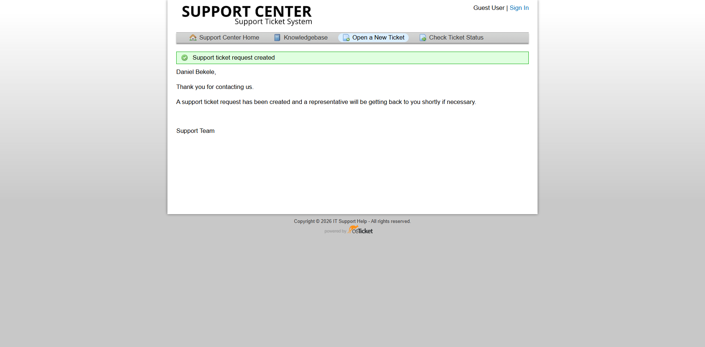

#osTicket Configuration

##Overview

After installing osTicket, the service desk environment was configured to simulate the structure and workflow of a small internal IT Support team.

The configuration focused on organizing incoming requests, assigning responsibility, categorizing incidents, managing service expectations, and providing users with self-service troubleshooting resources.

---

###Department Structure

A Support department was configured as the primary destination for IT Support requests.

The department provides a logical ownership structure for incoming tickets and allows tickets to be routed to the appropriate support team.

*Configured Support department in osTicket.*

---

###Support Agents

Support staff accounts were configured to represent technicians working within the service desk.

The project included agents such as:

- Alex Morgan
- Daniel Kim
- Solomon Aemiro

For the practical ticket scenarios, Alex Morgan was used as the Level 1 support technician responsible for investigating and resolving incidents.

*Configured support agents in the osTicket Staff panel.*

---

###Help Topics

Help Topics were configured to categorize incoming support requests according to the type of technical problem being reported.

The configured topics included categories such as:

- Software Issue
- Software / Application Support
- Network / Internet Issue
- Password / Account Issue
- Hardware Issue
- Printer / Peripheral Issue
- Security / Malware
- New Equipment / Software Request
- General Inquiry

Help Topics provide a consistent way to classify incidents and can be used to route tickets to the appropriate support workflow.

*Configured Help Topics used to classify incoming support requests.*

---

###Priority Management

Tickets were assigned an appropriate priority based on the reported issue.

The practical scenarios primarily used Normal priority because the simulated incidents represented standard end-user support requests rather than critical business outages.

Priority management provides a mechanism for distinguishing routine incidents from issues requiring more urgent attention.

*Ticket metadata including priority and other information used during triage.*

---

###SLA Configuration

The service desk was configured with a Default SLA Plan.

SLA configuration provides a framework for establishing expected response or resolution timelines for support requests.

For example, the practical tickets displayed a due date based on the configured SLA.

*Configured SLA plans available within the service desk.*

*Ticket assignment and SLA-related information recorded during the support workflow.*

---

###Ticket Assignment

Tickets were assigned to a specific support technician during the troubleshooting workflow.

For the practical scenarios, tickets were assigned to Alex M to simulate ownership by a Level 1 support technician.

Assignment establishes clear responsibility for investigating the incident and prevents support requests from remaining indefinitely unowned.

*Ticket assigned to Alex Morgan for Level 1 investigation.*

---

###Email Configuration

An internal support email identity was configured for the service desk:

"Support <support@apex.local>"

The address was used as the service desk's internal support identity.

Because this is a closed laboratory environment, external SMTP delivery was not required for the core ticket-management exercises.

The project therefore focused on the ticketing workflow rather than configuring external email infrastructure.

*Support email identity configured for the laboratory service desk environment.*

---

###Knowledge Base

The Knowledge Base was enabled to provide self-service troubleshooting information.

Knowledge Base categories were created to organize troubleshooting content, and public FAQs were added for common support problems.
The resources were written in user-friendly language so that an end user could follow basic troubleshooting steps without requiring a technician for every routine issue.

###Examples included:

- Windows performance troubleshooting
- Windows application problems
- Wi-Fi connectivity
- Internet access
- Password and login problems
- Locked accounts
- Keyboard and mouse problems
- Printer troubleshooting

*Knowledge Base configuration used to organize self-service support content.*

*Public FAQ resources available to users for common troubleshooting issues.*

---

###Ticket Sources

The practical tickets were submitted through the Web source.

This represents a common service desk workflow in which end users submit support requests through a web-based support portal.

*Ticket submitted through the web-based support portal.*

---

###Internal Notes and Customer Communication

The ticket workflow used two different forms of communication:

###Internal Notes

Internal notes were used to document technical investigation, diagnostic findings, root cause, troubleshooting performed, and resolution details.

These notes provide an audit trail for support staff without exposing technical investigation details unnecessarily to the customer.

###Customer Replies

Customer-facing replies were used to communicate the outcome of the investigation and explain the resolution in clear language.

Separating internal technical documentation from customer communication reflects a common Service Desk practice.

*Ticket submitted through the web-based support portal.*

---

###Ticket Lifecycle

The configuration supported the complete ticket lifecycle used throughout the project:

Open → Assigned → Investigated → Diagnosed → Resolved → Verified → Communicated → Closed

The same workflow was applied to the practical troubleshooting scenarios documented in this project.

---

###Configuration Summary

Area| Configuration
Department| Support
Support Agents| Alex Morgan, Daniel Kim, Solomon Aemiro
Primary Technician| Alex M
SLA| Default SLA
Ticket Priority| Normal for standard scenarios
Ticket Source| Web
Support Email| "support@apex.local" (labratory environment)
Knowledge Base| Enabled
Ticket Documentation| Internal Notes + Customer Replies

---

###Configuration Outcome

The completed configuration transformed the initial osTicket installation into a functional Service Desk simulation.

The environment could accept user requests, categorize and assign tickets, track SLA information, provide Knowledge Base resources, document troubleshooting activity, communicate with users, and close completed incidents.

This configuration formed the operational foundation for the practical ticket scenarios documented in the following sections.