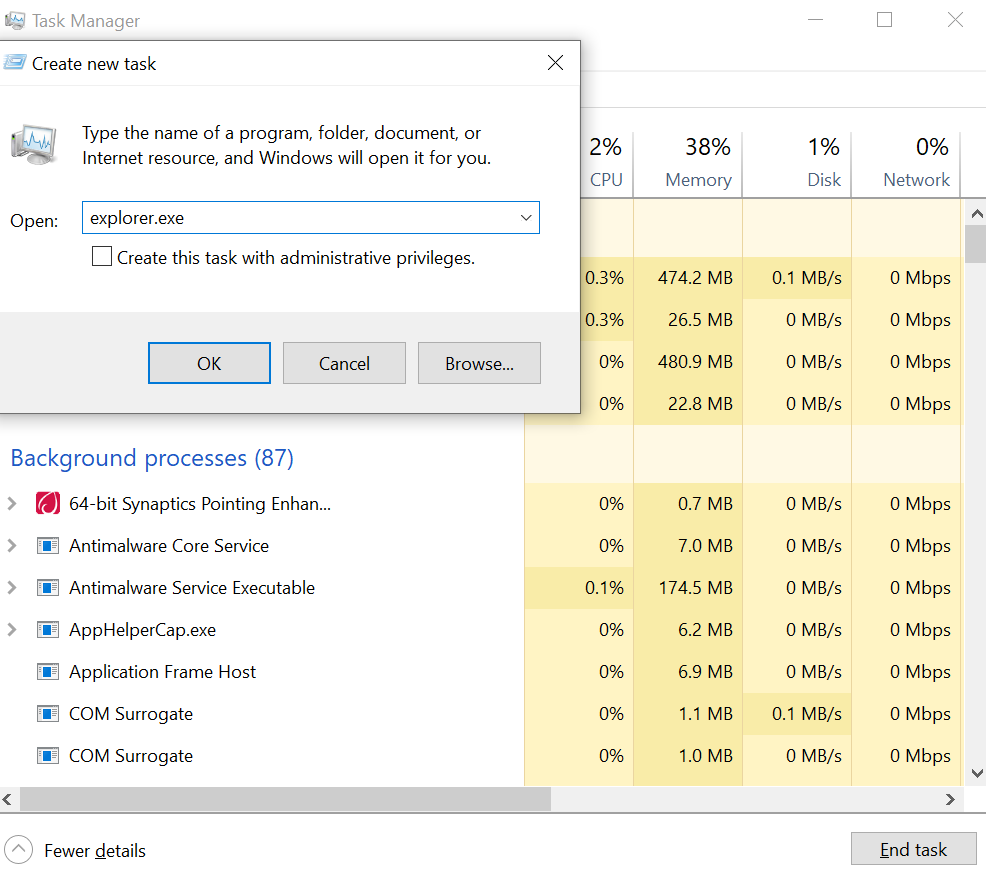

#Ticket #354151 — Black Screen After Login

#Incident Summary

The user reported that after successfully logging into Windows, the desktop did not load and the screen remained black.

The issue was investigated as a Windows desktop/shell problem.

Status: Open
Priority: Normal
Department: Support
Source: Web

*Ticket #354151 showing the reported black-screen incident.*

---

###Initial Assessment

The workstation successfully reached the Windows login process, but the normal desktop environment did not appear after authentication.

The reported symptom was a black screen rather than a complete failure to boot.

This suggested that Windows itself had started, but a component responsible for displaying the normal desktop environment might not have launched correctly.

---

###Step 1 — Confirm Windows Was Responsive

The first step was to determine whether Windows was still running and responsive.

The keyboard shortcut:

Ctrl + Shift + Esc

was used to open Task Manager.

Task Manager opened successfully, confirming that Windows was running and responding to user input.

---

###Step 2 — Check the Windows Shell

The Windows desktop is normally provided by the Windows shell process, "explorer.exe".

Task Manager was used to determine whether the shell was running.

The investigation indicated that "explorer.exe" was not providing the normal desktop environment.

This narrowed the problem to the Windows shell rather than a complete operating system failure.

---

###Step 3 — Manually Launch Explorer

From Task Manager, Run new task was selected.

The following command was entered:

explorer.exe

The command was then executed.

*Windows remained at the black-screen state after login.*

---

###Resolution

After "explorer.exe" was launched manually, the Windows desktop environment appeared.

The taskbar, Start menu, desktop icons, and normal Windows interface became available again.

This confirmed that the black screen was caused by the Windows shell not launching normally rather than a display hardware failure.

---

###Verification

The original user-facing symptom was tested again.

The workstation successfully displayed:

- Windows desktop
- Taskbar
- Start menu
- Desktop interface

The workstation was therefore considered operational.

The ticket was closed after confirming that the desktop environment had been restored.

*Ticket #354151 after the issue was resolved and the ticket was closed.*

---

###Internal Documentation

The troubleshooting activity and resolution were documented in an internal ticket note.

The note recorded that the Windows shell was not providing the desktop and that manually launching "explorer.exe" restored the user's desktop environment.

*Internal note documenting the troubleshooting and resolution.*

---

###Key Lesson

A black screen after login does not necessarily mean that Windows has completely failed.

If Windows responds to Ctrl + Shift + Esc, Task Manager can provide an important diagnostic path.

In this case, manually launching "explorer.exe" restored the Windows shell and returned the workstation to normal operation.

The incident demonstrates the importance of determining what part of the system is actually failing before taking more disruptive troubleshooting actions.